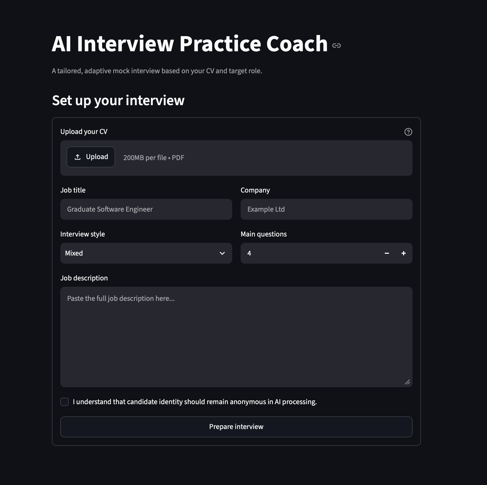

# HR Nexus - AI Hackathon

We are building an AI-powered interview practice coach for a hackathon.

The coach is designed for anyone who wants more specific and structured interview preparation than a generic conversation with an LLM. It uses the candidate's CV, target job description and interview preferences to create a personalised mock interview and practical feedback.


![interview similation]](readmepics/Screenshot 2026-08-05 at 18.35.37.png)

## Features

- Upload a text-based CV as a PDF.
- Paste a target job description.
- Enter the company name, role title and interview type.
- Choose an interview style and enter between 1 and 19 main questions.
- Automatically remove likely personal identifiers from the CV before AI processing.
- Receive interview questions tailored to the candidate's experience and target role.
- Answer questions one at a time through the Streamlit dashboard.
- Receive adaptive follow-up questions when an important detail is missing.
- Skip the current question or end the interview early.
- Request optional feedback on individual answers.
- Generate an overall report covering relevance, evidence, structure and role alignment.
- Download the anonymised input and final report as JSON files.

## How It Works

1. The user uploads their CV and enters the target role information.
2. `inputhandle.py` extracts and anonymises the CV text, then creates a structured JSON payload.
3. `interview_engine.py` uses the payload to generate tailored questions and manage adaptive follow-ups.
4. `frontend.py` controls the interview flow, user answers, skipped questions and early completion.
5. `interview_report.py` scores the submitted answers and produces the final feedback report.

## Project Structure

- `frontend.py` - Streamlit dashboard and interview session state.
- `inputhandle.py` - PDF extraction, anonymisation and input JSON creation.
- `interview_engine.py` - Question generation, follow-ups and interview logic.
- `prompts.py` - Prompts used by the interview engine.
- `schemas.py` - Shared interview data structures.
- `interview_report.py` - Per-answer scoring and final report generation.
- `test_data/` - Fictional CVs and job descriptions for demonstrations.

## Run Locally

```bash
python3 -m venv .venv
.venv/bin/python -m pip install -r requirements.txt
.venv/bin/streamlit run frontend.py
```

Add your `OPENAI_API_KEY` to `.env` before starting the application.

## Responsible AI

The application removes likely names, email addresses, phone numbers, postcodes and profile links before sending CV text for AI processing. This anonymisation is best effort and users should still review sensitive information. Feedback is intended for interview practice only and should not be treated as a hiring decision or professional careers advice.

## Test Data

The `test_data` folder contains fictional CVs and job descriptions that can be used to demonstrate the complete workflow without exposing real personal information.


